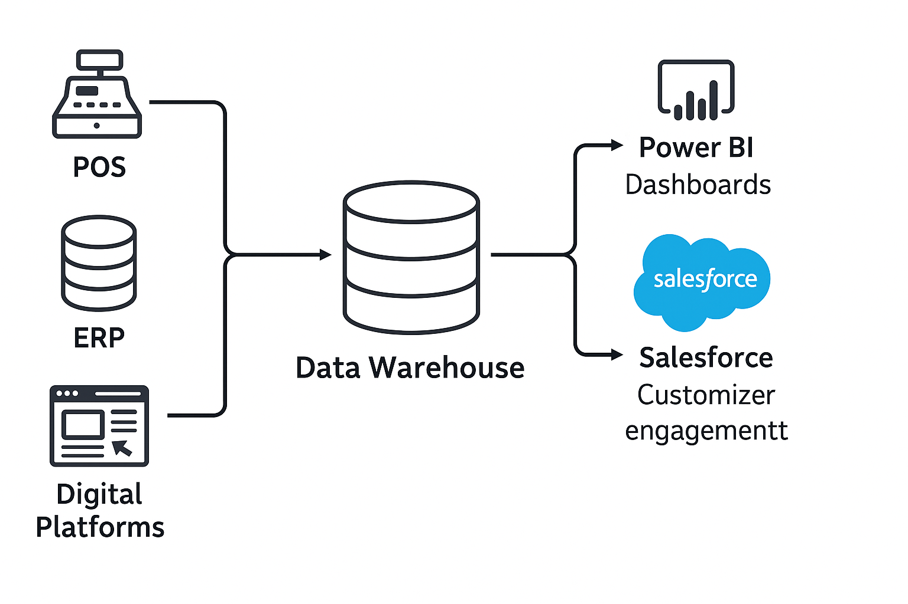

# Eason Sons & Ltd Business Intelligence & CRM Project

## Overview

This project delivers an end-to-end Business Intelligence (BI) and Customer Relationship Management (CRM) solution for Eason Sons & Ltd, a leading Irish retail company. It leverages Salesforce for CRM, Power BI for analytics and reporting, and PostgreSQL as the central data warehouse. The project addresses operational inefficiencies, fragmented data, and declining sales through data-driven process modernization.

---

## Key Technologies

- **Salesforce** (CRM configuration, access controls, validation rules)
- **Power BI** (Dashboards, DAX, analytics)
- **PostgreSQL** (Database schema, data warehouse)
- **Python** (ETL for data cleaning and loading)
- **Mockaroo** (Synthetic/mock data generation)

---

## Repository Structure

```
eason-bi-crm-analytics/
│
├── README.md
├── LICENSE
├── .gitignore
│
├── docs/
│   ├── Strategic_Report.pdf
│   ├── Implementation_Report.pdf
│   └── Presentation.pptx
│
├── data/
│   ├── mockaroo_customers.csv
│   ├── mockaroo_products.csv
│   └── ... (other mock data)
│
├── sql/
│   ├── schema.sql
│   ├── data_load_scripts.sql
│
├── python_etl/
│   ├── etl_script.py
│   └── requirements.txt
│
├── powerbi/
│   └── dashboards/
│
├── salesforce/
│   ├── object_definitions/
│   └── screenshots/
│
└── images/
    └── architecture_diagram.png
```

---

## Project Highlights

- **Custom Salesforce CRM:** Tailored objects, validation rules, access profiles, and sharing rules for sales, customer, and inventory data.
- **Power BI Dashboards:** Interactive analytics for sales, inventory, and customer segmentation, connected directly to PostgreSQL.
- **Automated ETL:** Python scripts for transforming and loading data from Mockaroo to PostgreSQL.
- **Robust Data Model:** Normalized tables, referential integrity, and clear documentation.
- **Business Insights:** Clear KPIs, seasonality analysis, customer value segmentation, and inventory efficiency.

---

## Setup & Usage

1. **Clone this repository**
   ```bash
   git clone https://github.com/YOURUSERNAME/eason-bi-crm-analytics.git
   cd eason-bi-crm-analytics
   ```

2. **Database**
   - Run the SQL scripts in `/sql/` to create tables and load sample data in PostgreSQL.

3. **Salesforce**
   - Use provided object definitions and screenshots to replicate the CRM setup.
   - Import sample data with Salesforce Data Import Wizard.

4. **Power BI**
   - Open the provided `.pbix` files in `/powerbi/dashboards/` to explore analytics.
   - Connect to your own PostgreSQL if you wish to refresh or customize dashboards.

5. **ETL Scripts**
   - See `/python_etl/` for data cleaning and loading scripts.

---

## Demo

> **System Architecture**
>
> 
>
> **Power BI Sales Dashboard**
>
> 

---

## Contributors

- Olamide Abioro — Salesforce Implementation, Data Import, Documentation  
- Muhammad Osama Hassan Khan —   Data Preparation, System Architecture, Business Analysis
- Liton Nath — Power BI, Analytics, Dashboard Design

---

## License

This project is open-source for educational purposes. See [LICENSE](LICENSE) for more details.

---

## References

- Salesforce Documentation  
- Microsoft Power BI Documentation  
- Mockaroo Data Generator  
- Project Reports (see `/docs/`)

---

